<div align="center">

**English** | [简体中文](README.zh-CN.md)

# ⚖️ Maat

### Intent → UI → evidence → executable truth

[](https://www.typescriptlang.org/)
[](https://playwright.dev/)
[](https://appium.io/)
[](https://github.com/houlianpi/Maat/actions/workflows/ci.yml)

</div>

Maat is a conversational UI testing Harness. The Agent explores real interfaces, executes focused JavaScript, records observations and successful steps, validates them with fresh Sessions, and saves one standard Mocha TypeScript Case that runs without an LLM.

## Quick start

Install Maat as a Pi package:

```bash
pi install npm:@houlianpi/maat-pi
pi
# In Pi: /maat-status
```

This keeps Pi's normal UI and conversation and adds Maat's platform, exploration, Case and
Evidence tools. Update an existing installation with:

```bash
pi update npm:@houlianpi/maat-pi
```

To run the standalone Maat TUI or Agent, install the npm executable normally:

```bash
npm install --global @houlianpi/maat
maat
maat agent --browser chromium --headless "Test the checkout flow"
```

Maat is published as three packages: host-neutral `@houlianpi/maat-core`, Pi Extension
`@houlianpi/maat-pi`, and standalone `@houlianpi/maat`. Published packages contain compiled
JavaScript under `dist`; Core and Platform Adapters do not depend on any Host SDK.

Describe the UI, actions, and explicit business outcome. Maat uses `exe_js` against the active Adapter. Web exposes Playwright `page/context/browser`; Android, iOS and macOS expose WebdriverIO `driver/browser` backed by an Appium Session.

## One Case format

Cases live under `maat-tests/<owner-platform>/cases/<business-module>`. Pure Web belongs to `web`; Android and iOS belong to their mobile platform; Web + macOS/Windows mixed Cases belong to the OS platform.

```typescript
import { describe, it } from 'mocha';
import { createMaatTest } from '@houlianpi/maat-core/test';

describe('Web opens desktop confirmation', () => {
  it('mixed-confirmation', async () => {
    const maat = await createMaatTest('mixed-confirmation', [
      { adapterId: 'web', setup: { browser: 'chrome' } },
      { adapterId: 'macos', setup: { app: { 'appium:bundleId': 'com.example.desktop' } } },
    ]);
    let passed = false;
    await maat.setup();
    try {
      await maat.step('Open web', 'web', async ({ page }) => {
        await page.goto('https://example.com');
      });
      await maat.step('Confirm desktop', 'macos', async ({ driver }) => {
        await driver.$('~Confirm').click();
      });
      await maat.step('Verify web', 'web', async ({ page, expect }) => {
        await expect(page.locator('.status')).toHaveText('Success');
      });
      passed = true;
    } finally {
      await maat.teardown({ passed });
    }
  });
});
```

The SessionPool creates only referenced Sessions. Returning to `web` reuses the original Playwright Page. Pure Web Cases never create or load Appium Sessions.

## Harness flow

```mermaid
flowchart LR
  User --> Agent
  Agent --> Execute[exe_js]
  Execute --> Worker[shared killable Worker Harness]
  Worker --> Adapter[active Platform Runtime]
  Adapter --> Observation
  Observation --> Draft
  Draft --> Candidate[one Mocha spec]
  Candidate --> Validate[fresh SessionPool validation]
  Validate --> Case[formal Case]
  Case --> Runner[Maat Mocha Runner]
  Runner --> Report[Evidence + HTML report]
```



Exploration uses one common Worker Host/Client and independent Worker instances per active Adapter. Formal Cases execute saved TypeScript through the Maat runner and do not use exploration Workers.

## Adapters and Session setup

Built-in Adapters: Web, Android, iOS, macOS. Core depends only on `PlatformAdapter` and `PlatformRegistry`; adding another Adapter does not change Case, Runner, Renderer, SessionPool or Evidence.

For Appium, Maat resolves a reachable Server and device, then creates and deletes its own Session. Driver installation, Server startup, ADB/Xcode, signing, simulators and OS permissions are prepared by the user or Agent through Shell. See [Appium Sessions](docs/native-testing.md).

For a local macOS Mac2 session:

```bash
npm install --global appium
appium driver install mac2
appium driver doctor mac2
appium --address 127.0.0.1 --port 4723
```

Use the capability returned by `find_applications`, for example
`{ "appium:bundleId": "com.apple.calculator" }`. Maat also normalizes the legacy bare
`bundleId`, but new integrations should use W3C vendor-prefixed Appium names.

Optional Appium Session hints live outside the test tree under `~/.maat/session-hints/<adapter>.json`. The `maat-tests` tree contains Cases only.

## Tools

| Tool                                 | Purpose                                                 |
| ------------------------------------ | ------------------------------------------------------- |
| `list_platforms` / `select_platform` | Inspect and select an Adapter                           |
| `configure_session`                  | Supply optional Server/device/App hints                 |
| `list_devices` / `find_applications` | Assist Appium Session setup                             |
| `begin_case`                         | Create a Draft with explicit objectives                 |
| `exe_js`                             | Execute JavaScript in the active persistent UI Session  |
| `get_case_status`                    | Inspect steps, attempts and Evidence                    |
| `list/remove/replace_case_step`      | Review and edit formal candidate steps                  |
| `save_case`                          | Validate with fresh Sessions and promote one Mocha spec |

Assist mode permits Shell/setup work. Case mode blocks Shell and direct file edits while exploration and generation are active.

Inside `exe_js`, use `console.log()` for text and `display()` only for PNG/JPEG/WebP image bytes
or base64 data URLs. Prefer `await evidence.screenshot('result')` for screenshots. Invalid image
values fail the tool call and are never written into the Pi transcript. macOS accessibility values
may contain Unicode format controls; normalize user-visible text before assertions when needed:

```javascript
const value = await result.getAttribute('value');
expect(value.replace(/\p{Cf}/gu, '').trim()).toBe('7');
```

`exe_js` is exploratory by default. Set `record: true` with a concise `stepName` only for minimal
reusable business actions/assertions. Page-source dumps, element inventories and setup diagnostics
must remain unrecorded. Review `list_case_steps` before saving.

## Migrate from 0.1.x

```bash
pi remove npm:@houlianpi/maat
pi install npm:@houlianpi/maat-pi
```

Existing Cases should import `@houlianpi/maat-core/test` instead of `@houlianpi/maat/test`.

## Run and report

```bash
maat test --case calculator-basic-addition
maat test --suite smoke --browser chrome
maat test --tag calculator
maat test --all
```

Cases that target interchangeable native App variants accept the App identifier at runtime. The
same Android Edge Case can run against Stable or Canary, and package-qualified resource IDs are
derived from that same value:

```bash
maat test --project android --case edge-exit-browser-cancel --app-id com.microsoft.emmx
maat test --project android --case edge-exit-browser-cancel --app-id com.microsoft.emmx.canary
```

Formal output is grouped under `artifacts/maat/runs/<run-id>`:

```text
mocha.log
result.json
report/index.html
cases/<case-id>/evidence.json
cases/<case-id>/*.png
```

Exploration Evidence and failed attempts live under `artifacts/cases/<case-id>`.

## Architecture

```text
packages/
├── core/          host-neutral API, Adapters, Worker, Case Runner, Evidence and test fixture
├── pi/            Pi Extension, tools, prompt, work mode and status UI
└── maat/          standalone TUI, Agent, CLI and executable
```

Future Codex, Claude Code or DeepSeek integrations are added as parallel Host packages depending
on `maat-core`; Core never imports a Host SDK.

The Worker is a killable process boundary with timeout, Abort, code/output limits and sensitive environment filtering. It is not an OS or container sandbox.

## Development

```bash
npm install
npm run build
npm run typecheck
npm test
npm run package:check
maat test --suite smoke --browser chromium
```

`package:check` builds, packs and installs the tarball in a temporary directory, then smoke-tests
the installed CLI and Worker. This catches failures that do not reproduce from a source checkout.

## npm releases

Publishing is handled by `.github/workflows/publish.yml`. A non-prerelease GitHub Release whose
tag exactly matches `v<workspace version>` runs formatting, type checking, all project tests, and
three tarball installation checks before publishing Core → Pi Extension → standalone Maat with
provenance.

Publishing uses npm Trusted Publishing for repository `houlianpi/Maat`, workflow `publish.yml` and
GitHub Environment `npm`. Do not add an `NPM_TOKEN`: a token overrides OIDC publishing and may
trigger an interactive OTP failure. Keep required reviewers on the Environment if releases need
approval.

Release sequence:

```bash
npm version 0.2.1 --workspaces --include-workspace-root
git push origin main --follow-tags
# Create the matching GitHub Release from the pushed vX.Y.Z tag.
```

The current dependency audit reports 16 high-severity transitive advisories. They are not suppressed or force-upgraded; review upstream fixes before production distribution.
