<div align="center">

**English** | [简体中文](README.zh-CN.md)

# ⚖️ Maat

### Intent → UI → evidence → executable truth

[](https://www.typescriptlang.org/)
[](https://playwright.dev/)
[](https://appium.io/)
[](https://github.com/houlianpi/Maat/actions/workflows/ci.yml)

</div>

Maat is a conversational UI testing Harness. The Agent explores real interfaces, executes focused JavaScript, records observations and successful steps, validates them with fresh Sessions, and saves one standard Mocha TypeScript Case that runs without an LLM.

## Quick start

```bash
git clone https://github.com/houlianpi/Maat.git
cd Maat
npm install
npm link
maat
```

Use Maat inside an existing Pi coding-agent session without replacing Pi's normal UI or
conversation:

```bash
pi -e ./src/hosts/pi/extension.ts
# Once published: pi install npm:@houlianpi/maat
```

The Pi Extension adds Maat's platform, exploration, Case, and Evidence tools plus
`/maat-status`. All hosts share the same host-neutral `MaatApi`; Core and Platform Adapters do
not depend on the Pi SDK.

Describe the UI, actions, and explicit business outcome. Maat uses `exe_js` against the active Adapter. Web exposes Playwright `page/context/browser`; Android, iOS and macOS expose WebdriverIO `driver/browser` backed by an Appium Session.

## One Case format

Cases live under `maat-tests/<owner-platform>/cases/<business-module>`. Pure Web belongs to `web`; Android and iOS belong to their mobile platform; Web + macOS/Windows mixed Cases belong to the OS platform.

```typescript
import { describe, it } from 'mocha';
import { createMaatTest } from '@houlianpi/maat/test';

describe('Web opens desktop confirmation', () => {
  it('mixed-confirmation', async () => {
    const maat = await createMaatTest('mixed-confirmation', [
      { adapterId: 'web', setup: { browser: 'chrome' } },
      { adapterId: 'macos', setup: { app: { 'appium:bundleId': 'com.example.desktop' } } },
    ]);
    let passed = false;
    try {
      await maat.step('Open web', 'web', async ({ page }) => {
        await page.goto('https://example.com');
      });
      await maat.step('Confirm desktop', 'macos', async ({ driver }) => {
        await driver.$('~Confirm').click();
      });
      await maat.step('Verify web', 'web', async ({ page, expect }) => {
        await expect(page.locator('.status')).toHaveText('Success');
      });
      passed = true;
    } finally {
      await maat.close(passed);
    }
  });
});
```

The SessionPool creates only referenced Sessions. Returning to `web` reuses the original Playwright Page. Pure Web Cases never create or load Appium Sessions.

## Harness flow

```mermaid
flowchart LR
  User --> Agent
  Agent --> Execute[exe_js]
  Execute --> Worker[shared killable Worker Harness]
  Worker --> Adapter[active Platform Runtime]
  Adapter --> Observation
  Observation --> Draft
  Draft --> Candidate[one Mocha spec]
  Candidate --> Validate[fresh SessionPool validation]
  Validate --> Case[formal Case]
  Case --> Runner[Maat Mocha Runner]
  Runner --> Report[Evidence + HTML report]
```



Exploration uses one common Worker Host/Client and independent Worker instances per active Adapter. Formal Cases execute compiled TypeScript directly and do not use exploration Workers.

## Adapters and Session setup

Built-in Adapters: Web, Android, iOS, macOS. Core depends only on `PlatformAdapter` and `PlatformRegistry`; adding another Adapter does not change Case, Runner, Renderer, SessionPool or Evidence.

For Appium, Maat resolves a reachable Server and device, then creates and deletes its own Session. Driver installation, Server startup, ADB/Xcode, signing, simulators and OS permissions are prepared by the user or Agent through Shell. See [Appium Sessions](docs/native-testing.md).

Optional Appium Session hints live outside the test tree under `~/.maat/session-hints/<adapter>.json`. The `maat-tests` tree contains Cases only.

## Tools

| Tool                                 | Purpose                                                 |
| ------------------------------------ | ------------------------------------------------------- |
| `list_platforms` / `select_platform` | Inspect and select an Adapter                           |
| `configure_session`                  | Supply optional Server/device/App hints                 |
| `list_devices` / `find_applications` | Assist Appium Session setup                             |
| `begin_case`                         | Create a Draft with explicit objectives                 |
| `exe_js`                             | Execute JavaScript in the active persistent UI Session  |
| `get_case_status`                    | Inspect steps, attempts and Evidence                    |
| `save_case`                          | Validate with fresh Sessions and promote one Mocha spec |

Assist mode permits Shell/setup work. Case mode blocks Shell and direct file edits while exploration and generation are active.

## Run and report

```bash
maat test --case calculator-basic-addition
maat test --suite smoke --browser chrome
maat test --tag calculator
maat test --all
```

Cases that target interchangeable native App variants accept the App identifier at runtime. The
same Android Edge Case can run against Stable or Canary, and package-qualified resource IDs are
derived from that same value:

```bash
maat test --project android --case edge-exit-browser-cancel --app-id com.microsoft.emmx
maat test --project android --case edge-exit-browser-cancel --app-id com.microsoft.emmx.canary
```

Formal output is grouped under `artifacts/maat/runs/<run-id>`:

```text
mocha.log
result.json
report/index.html
cases/<case-id>/evidence.json
cases/<case-id>/*.png
```

Exploration Evidence and failed attempts live under `artifacts/cases/<case-id>`.

## Architecture

```text
src/
├── api/           stable host-neutral MaatApi composition surface
├── core/          framework-agnostic Case, Worker, Runner, SessionPool, Evidence, contracts
├── platforms/     Web, Android, iOS, macOS and shared Appium implementations
├── hosts/         standalone Pi Agent/TUI, installable Pi Extension and Mocha test host
├── tools/         Agent-facing tools
├── setup/         optional browser/device/application discovery
└── cli/           thin command entry points
```

The Worker is a killable process boundary with timeout, Abort, code/output limits and sensitive environment filtering. It is not an OS or container sandbox.

## Development

```bash
npm install
npm run typecheck
npm test
maat test --suite smoke --browser chromium
```

The current dependency audit reports 16 high-severity transitive advisories. They are not suppressed or force-upgraded; review upstream fixes before production distribution.
