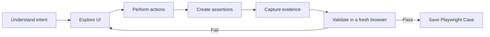
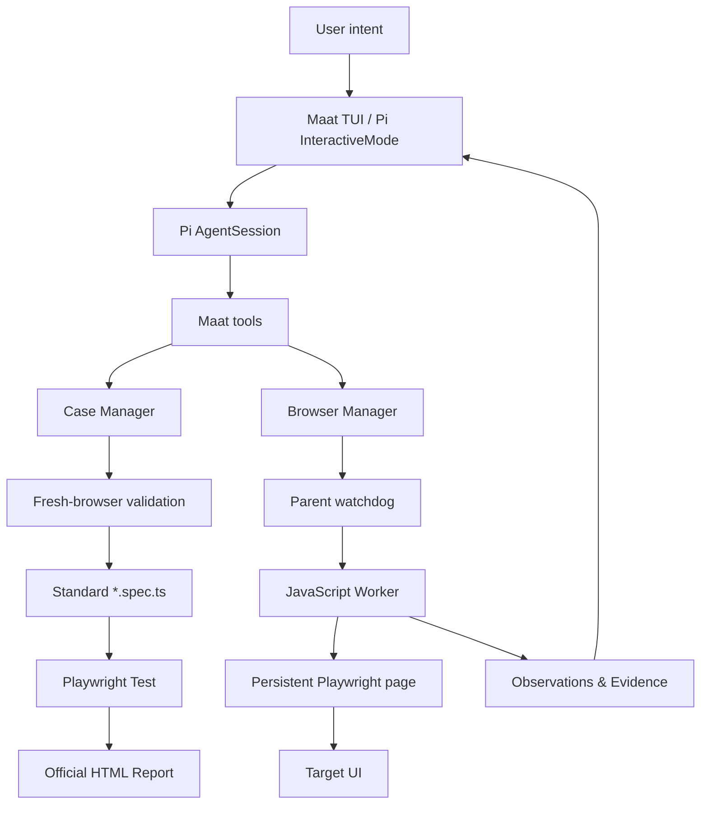

<div align="center">

**English** | [简体中文](README.zh-CN.md)

# ⚖️ Maat

### Turn intent into executable UI truth.

**Build, validate, and maintain UI tests through conversation.**

[](https://www.typescriptlang.org/)
[](https://playwright.dev/)
[](https://pi.dev/docs/latest/sdk)
[](#current-scope)

</div>

---

Maat is a conversational UI testing agent. Describe **what you want to test** and **what success looks like**; Maat explores the interface, performs actions, creates focused assertions, captures evidence, and saves a standard Playwright Test.

```text
Intent → UI exploration → Business assertions → Evidence → Playwright Test → Report
```

> **Maat** is named after the ancient Egyptian concept of truth, order, and balance: actual UI state on one side of the scale, human intent on the other.

## ✨ Why Maat?

- **Conversational authoring** — refine a test over multiple turns in an interactive TUI.
- **Intent-driven assertions** — assert explicit business outcomes instead of every operational prerequisite.
- **Live browser exploration** — observe, operate, and correct a persistent Playwright page.
- **Killable execution boundary** — model-generated JavaScript runs in a worker with timeouts, aborts, and output limits.
- **One-file Cases** — human intent, tags, suites, code, and assertions live in one `*.spec.ts` file.
- **Native Playwright ecosystem** — formal Cases use Playwright Test, projects, HTML reports, traces, and screenshots.
- **Evidence first** — inspect screenshots in the TUI and attach final-state screenshots to formal reports.
- **Flexible modules** — organize Cases by domain, feature, team, or any directory structure you choose.

## 🎬 Quick start

### Requirements

- Node.js 22+ (development currently uses Node.js 26)
- Chrome, Edge, or Playwright Chromium
- A configured and authenticated [Pi](https://pi.dev/) model provider

### Install from source

```bash
git clone https://github.com/houlianpi/Maat.git
cd Maat
npm install
npm link
```

Start the interactive experience:

```bash
maat
```

Maat defaults to Chrome, headless mode, and an isolated temporary profile.

Then describe a Case:

```text
Build and save a test Case for https://www.leaftools.net/calculator.

Module: calculator
Case ID: calculator-basic-addition
Name: Basic addition
Test objective: verify that 12 + 30 displays 42.
Tags: calculator, smoke
Suite: smoke
```

Maat handles the workflow:



## 🧭 Interactive workflow

Maat embeds Pi's native TUI for streaming conversations, tool calls, sessions, models, thinking controls, and token status. It adds its own runtime panel:

```text
Maat
Conversational UI verification · intent → evidence → executable truth

Browser  chrome · headless · temporary profile · idle
Case     calculator-basic-addition · 3 steps · 0 failed attempts
Evidence 4 items · 1 objectives
```

Continue naturally:

```text
Switch to Edge and show the browser window.
Show the current Case status.
List the Evidence.
Show the latest screenshot.
Save this Case under the calculator module.
```

| Tool | Purpose |
|---|---|
| `configure_browser` | Switch browser, headless/headed mode, and logical profile |
| `get_browser_config` | Inspect the active browser configuration |
| `begin_case` | Start a Case Draft with explicit objectives |
| `exec_js` | Operate the persistent page and execute Playwright `expect` assertions |
| `get_case_status` | Inspect candidate steps, failed attempts, and Evidence counts |
| `list_evidence` | List Evidence captured for the active Case |
| `show_evidence` | Render screenshots in supported terminals |
| `save_case` | Revalidate in a fresh browser and save the formal Case |

## 🧪 A Case is just Playwright Test

Formal Cases do not require an LLM at runtime. They are ordinary Playwright Tests:

```typescript
/**
 * Case ID: calculator-basic-addition
 * Name: Basic addition
 *
 * Description:
 * Verify that an online calculator correctly computes 12 + 30.
 *
 * Test objectives:
 * 1. The final result displays 42.
 */

import { test, expect } from "../../fixtures/maat-test.ts";

test.describe("Basic addition", {
  tag: ["@calculator", "@smoke", "@suite:smoke"],
  annotation: [
    { type: "Case ID", description: "calculator-basic-addition" },
    { type: "Test objectives", description: "The final result displays 42." },
  ],
}, () => {
  test("calculator-basic-addition", async ({ page }) => {
    await page.goto("https://www.leaftools.net/calculator", {
      waitUntil: "domcontentloaded",
    });
    await expect(page.locator(".curr")).toHaveText("42");
  });
});
```

JSDoc keeps intent next to code. The same data is emitted as Playwright `annotation` entries so it appears in the official HTML report.

See a real Case: [calculator-basic-addition.spec.ts](maat-tests/cases/calculator/calculator-basic-addition.spec.ts)

## 🗂️ Organize Cases your way

Cases use descriptive filenames; directories are yours to organize:

```text
maat-tests/
├── playwright.config.ts
├── fixtures/
│   └── maat-test.ts
└── cases/
    ├── calculator/
    │   ├── calculator-basic-addition.spec.ts
    │   └── calculator-32-plus-30.spec.ts
    ├── checkout/
    │   └── guest-checkout.spec.ts
    └── health-check.spec.ts
```

Nested modules such as `payments/refunds/refund-approved.spec.ts` are supported.

## 🚀 Run tests

```bash
# Unique short names are resolved recursively
maat test --case calculator-basic-addition

# Use a module path to disambiguate duplicate names
maat test --case calculator/calculator-basic-addition

# Suites and tags are Playwright tags
maat test --suite smoke
maat test --tag calculator

# Run every Case
maat test --all

# Browser project, headed mode, and workers
maat test --suite smoke --project edge
maat test --case calculator-basic-addition --headed
maat test --suite smoke --workers 2

# Playwright UI Mode
maat test --all --ui
```

`maat cases` remains as a compatibility alias for `maat test`.

## 📊 Evidence & reports

Maat uses the **official Playwright HTML Reporter** without modifying or forking it.

Unified settings live in [playwright.config.ts](maat-tests/playwright.config.ts); automatic final screenshots are provided by [maat-test.ts](maat-tests/fixtures/maat-test.ts).

Every formal Case provides:

- Case ID, description, preconditions, action steps, and test objectives
- `test.step` execution structure
- A full-page `final-state` screenshot on success and failure
- Failure screenshots and traces
- Explicit `display()` Evidence attachments
- Optional video via `MAAT_VIDEO=1 maat test --suite smoke`

Report location:

```text
artifacts/playwright/report/index.html
```

Open it with:

```bash
npx playwright show-report artifacts/playwright/report
```

Exploration Evidence and failed attempts live under:

```text
artifacts/cases/<case-id>/
├── evidence/
└── attempts/
```

## 🏗️ Architecture



| Layer | Responsibility |
|---|---|
| Pi SDK | Model calls, conversation, streaming, TUI, and session lifecycle |
| Maat | Browser configuration, Case intent, assertions, Evidence, and persistence |
| Worker | Killable execution boundary for model-generated JavaScript |
| Playwright | Browser automation, xUnit runner, projects, reports, traces, and screenshots |

Core implementation:

- [TUI runtime](src/tui/main.ts)
- [Case tools](src/cases/case-tools.ts)
- [Playwright spec generator](src/cases/playwright-spec-generator.ts)
- [JavaScript worker session](src/worker/javascript-session.ts)

## 🔐 Configuration isolation

```text
Shared:    Pi credentials and initial model catalog
Isolated:  Maat settings, sessions, skills, extensions, and project context
```

Maat stores its own state under:

```text
~/.maat/settings.json
~/.maat/sessions/
```

On first launch, Maat copies Pi's current default provider, model, thinking level, and theme. Future changes do not write back to regular Pi.

Logical browser profiles are configured in `maat-tests/maat.config.json`. Do not automate your everyday Chrome or Edge profile directly; use a dedicated automation profile.

## 🛡️ Safety model

The Worker is a **killable process boundary**, not a container-grade security sandbox.

Implemented safeguards:

- 60-second execution deadline and abort support
- 64 KiB code limit
- 12 MiB output limit
- IPC protocol validation
- Sensitive environment-variable filtering
- Forced Worker and browser cleanup

Filesystem, network, container, and OS-level isolation are not implemented. Do not execute unknown model-generated code in an untrusted environment.

## 🧰 CLI reference

```text
maat                         Start interactive TUI
maat tui                     Start interactive TUI
maat agent [options] PROMPT  Run one non-interactive task
maat test [options]          Run formal Playwright Cases
maat cases [options]         Compatibility alias for maat test
maat replay FILE [options]   Run an exploration Replay
maat help                    Show help
```

| Variable | Purpose |
|---|---|
| `MAAT_TRACE=0` | Disable model/tool trace logs in non-interactive mode |
| `MAAT_BROWSER_EXECUTABLE_PATH` | Set a browser executable for development/exploration |
| `MAAT_VIDEO=1` | Retain failure video for formal Playwright Cases |

## 🧑‍💻 Development

```bash
npm install
npm run typecheck
npm test
maat test --suite smoke --workers 2
```

## Current scope

Maat's long-term direction includes Web, Desktop, and Mobile UI automation adapters. **The current implementation is an experimental Web Adapter** powered by Playwright for Chromium, Chrome, Chrome Beta, Edge, and Edge Beta.

Desktop and Mobile adapters are not implemented yet.

## 🗺️ Roadmap

- [x] Conversational TUI
- [x] Persistent browser runtime
- [x] Killable JavaScript Worker
- [x] Intent-driven Playwright assertions
- [x] Evidence and final-state screenshots
- [x] Standard Playwright Test Cases
- [x] Tags, suites, projects, and HTML reports
- [ ] Maat business-focused custom Reporter
- [ ] Dedicated profile fixtures
- [ ] Desktop UI Adapter
- [ ] Mobile UI Adapter
- [ ] Container / OS sandbox
- [ ] CI templates and historical trends

---

<div align="center">

**Maat — intent, evidence, executable truth.**

</div>
