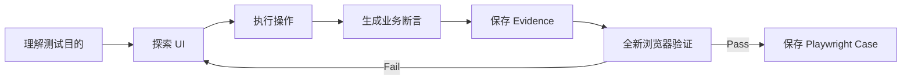
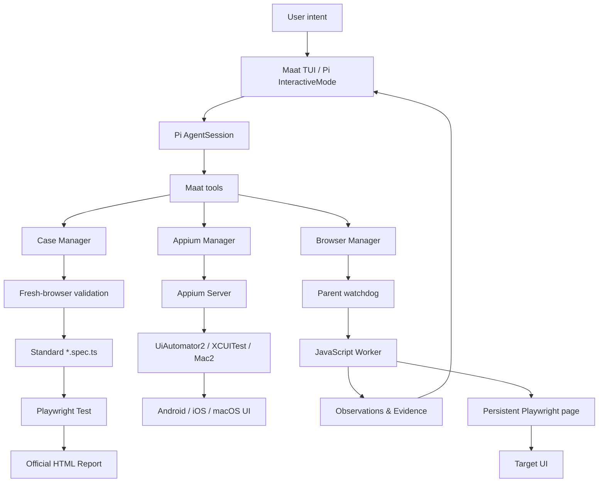

<div align="center">

[English](README.md) | **简体中文**

# ⚖️ Maat

### Turn intent into executable UI truth.

**对话式构建、验证和维护 UI 自动化测试。**

[](https://www.typescriptlang.org/)
[](https://playwright.dev/)
[](https://pi.dev/docs/latest/sdk)
[](#current-scope)
[](https://github.com/houlianpi/Maat/actions/workflows/ci.yml)

</div>

---

Maat 是一个对话式 UI 测试 Agent。你只需要说明**想测试什么**和**预期结果是什么**，Maat 会探索页面、执行操作、生成关键断言、收集 Evidence，并保存为标准 Playwright Test。

```text
测试意图 → UI 探索 → 业务断言 → Evidence → Playwright Test → Report
```

> **Maat** 源自古埃及关于真理、秩序与衡量的概念：将 UI 的实际状态与人的预期放在天平两端。

## ✨ Why Maat?

- **对话式构建**：在 TUI 中通过多轮聊天完善 Case。
- **目的驱动断言**：只针对明确测试目的生成 `expect`，不堆砌无意义检查。
- **真实浏览器探索**：模型通过持久 Playwright 页面观察、操作和修正。
- **可终止 Worker**：模型生成的 JavaScript 在独立进程执行，具备超时、Abort 和输出限制。
- **单文件 Case**：自然语言说明、Tags、Suite、代码和断言都在一个 `*.spec.ts`。
- **官方测试生态**：正式 Case 使用 Playwright Test、HTML Reporter、Trace 和截图。
- **Evidence first**：TUI 中可查看截图；正式报告自动附加最终页面全屏截图。
- **模块自由组织**：Case 可按业务域、模块或团队习惯任意分层。

## 🎬 Quick start

### Requirements

- Node.js 22+（当前开发环境使用 Node.js 26）
- Chrome、Edge 或 Playwright Chromium
- 已配置并登录的 [Pi](https://pi.dev/) 模型 Provider

### Install from source

```bash
git clone https://github.com/houlianpi/Maat.git
cd Maat
npm install
npm link
```

启动交互界面：

```bash
maat
```

默认使用 Chrome、Headless 和临时隔离 Profile。

进入 TUI 后，可以直接说：

```text
为 https://www.leaftools.net/calculator 构建并保存一个测试 Case。

模块：calculator
Case ID：calculator-basic-addition
名称：基础加法计算
测试目的：验证 12 + 30 的最终结果显示为 42。
标签：calculator、smoke
Suite：smoke
```

Maat 会自动完成：



## 🧭 Interactive workflow

Maat 复用 Pi 的原生 TUI，保留流式聊天、工具调用、Session、模型、Thinking 和 Token 状态，并增加自己的运行状态区：

```text
Maat
Conversational UI verification · intent → evidence → executable truth

Browser  chrome · headless · temporary profile · idle
Case     calculator-basic-addition · 3 steps · 0 failed attempts
Evidence 4 items · 1 objectives
```

可以自然地继续对话：

```text
切换到 Edge，并显示浏览器窗口。
显示当前 Case 状态。
列出 Evidence。
显示最后一张截图。
把这个 Case 保存到 calculator 模块。
```

| Tool | Purpose |
|---|---|
| `configure_browser` | 切换浏览器、Headless/Headed 和逻辑 Profile |
| `get_browser_config` | 查看当前浏览器配置 |
| `begin_case` | 创建带测试目的的 Case Draft |
| `exec_js` | 操作持久 Playwright 页面并执行 `expect` |
| `get_case_status` | 查看候选步骤、失败 Attempt 与 Evidence 数量 |
| `list_evidence` | 列出当前 Case 的 Evidence |
| `show_evidence` | 在支持图片协议的终端中显示截图 |
| `save_case` | 使用全新浏览器验证并保存正式 Case |

## 🧪 A Case is just Playwright Test

正式 Case 不依赖 LLM 才能运行。它是普通的 Playwright Test：

```typescript
/**
 * Case ID: calculator-basic-addition
 * Name: 基础加法计算
 *
 * Description:
 * 验证在线计算器正确计算 12 + 30。
 *
 * Test objectives:
 * 1. 最终结果显示 42
 */

import { test, expect } from "../../fixtures/maat-test.ts";

test.describe("基础加法计算", {
  tag: ["@calculator", "@smoke", "@suite:smoke"],
  annotation: [
    { type: "Case ID", description: "calculator-basic-addition" },
    { type: "Test objectives", description: "最终结果显示 42" },
  ],
}, () => {
  test("calculator-basic-addition", async ({ page }) => {
    await page.goto("https://www.leaftools.net/calculator", {
      waitUntil: "domcontentloaded",
    });
    await expect(page.locator(".curr")).toHaveText("42");
  });
});
```

JSDoc 方便源码阅读；相同信息还会写入 Playwright `annotation`，因此会出现在官方 HTML Report 中。

查看真实示例：[calculator-basic-addition.spec.ts](maat-tests/cases/calculator/calculator-basic-addition.spec.ts)

## 🗂️ Organize Cases your way

Case 以具名文件保存。目录只负责表达模块或业务域：

```text
maat-tests/
├── playwright.config.ts
├── fixtures/
│   └── maat-test.ts
└── cases/
    ├── calculator/
    │   ├── calculator-basic-addition.spec.ts
    │   └── calculator-32-plus-30.spec.ts
    ├── checkout/
    │   └── guest-checkout.spec.ts
    └── health-check.spec.ts
```

支持嵌套模块，例如 `payments/refunds/refund-approved.spec.ts`。

## 🚀 Run tests

```bash
# 单个 Case：短名称会递归查找
maat test --case calculator-basic-addition

# 模块路径：重名时使用此形式
maat test --case calculator/calculator-basic-addition

# Suite 与 Tag 来自 Playwright tags
maat test --suite smoke
maat test --tag calculator

# 全部 Case
maat test --all

# Browser Project / 可见模式 / 并发
maat test --suite smoke --project edge
maat test --case calculator-basic-addition --headed
maat test --suite smoke --workers 2

# Playwright UI Mode
maat test --all --ui
```

`maat cases` 仍作为 `maat test` 的兼容别名。

## 📱 使用 Appium 测试原生 UI

Maat 已接入 Appium Adapter，用于 Android、iOS 和 macOS 原生 UI 探索。

检查已安装 Driver：

```bash
maat appium doctor
maat appium doctor android
maat appium doctor ios
maat appium doctor macos
```

Maat 将 Appium Driver 保存在 `~/.maat/appium`。可通过 `MAAT_APPIUM_HOME` 覆盖此路径。

显式安装官方 Driver：

```bash
maat appium install android  # UiAutomator2
maat appium install ios      # XCUITest
maat appium install macos    # Mac2
```

然后在 TUI 中配置目标：

```text
配置 Appium 使用 Android。
使用 appPackage com.example.demo 和 appActivity .MainActivity。
启动 Session，读取页面 Source，并截取截图。
```

Maat 提供结构化的原生工具：配置、Session 生命周期、元素定位、点击与输入、Accessibility/XML Source、坐标 Tap 和截图。它不会暴露任意 Appium JavaScript 执行入口。

平台前置条件：

| 平台 | Driver | 运行环境 |
|---|---|---|
| Android | UiAutomator2 | Android SDK、ADB 和已连接设备或 Emulator |
| iOS | XCUITest | macOS、Xcode 和 iOS 设备或 Simulator |
| macOS | Mac2 | macOS、Xcode 和 Automation Mode 授权 |

当前已经支持原生 UI 探索与 Evidence 截图。正式 Appium xUnit Case 生成和原生 Suite Runner 是下一层；现阶段正式保存的 Case 仍是 Web UI 的 Playwright Test。

## 📊 Evidence & reports

Maat 使用 **Playwright 官方 HTML Reporter**，没有修改或 fork Reporter。

统一配置见 [playwright.config.ts](maat-tests/playwright.config.ts)，自动截图 fixture 见 [maat-test.ts](maat-tests/fixtures/maat-test.ts)。

每个正式 Case 自动提供：

- Case ID、Description、Preconditions、Action steps、Test objectives
- `test.step` 执行结构
- `final-state` 最终页面全屏截图（成功和失败都会附加）
- 失败截图与 Trace
- 显式 `display()` Evidence 附件
- 可选视频：`MAAT_VIDEO=1 maat test --suite smoke`

报告位置：

```text
artifacts/playwright/report/index.html
```

打开报告：

```bash
npx playwright show-report artifacts/playwright/report
```

探索阶段的 Evidence 与失败 Attempt 保存在：

```text
artifacts/cases/<case-id>/
├── evidence/
└── attempts/
```

## 🏗️ Architecture



| Layer | Owns |
|---|---|
| Pi SDK | Model calls, conversation, streaming, TUI and Session lifecycle |
| Maat | Browser configuration, Case intent, assertions, Evidence and persistence |
| Worker | Killable execution boundary for model-generated JavaScript |
| Playwright | Browser automation, xUnit runner, projects, reports, Trace and screenshots |
| Appium | Android、iOS 和 macOS 原生 Session、定位、操作、Source 与截图 |

核心实现入口：

- [TUI runtime](src/tui/main.ts)
- [Case tools](src/cases/case-tools.ts)
- [Playwright spec generator](src/cases/playwright-spec-generator.ts)
- [JavaScript worker session](src/worker/javascript-session.ts)
- [Appium manager](src/appium/appium-manager.ts)

## 🔐 Configuration isolation

```text
Shared:    Pi credentials and initial model catalog
Isolated:  Maat settings, Sessions, Skills, Extensions and project context
```

Maat 配置位于：

```text
~/.maat/settings.json
~/.maat/sessions/
```

Maat 第一次启动时复制 Pi 当前的默认 Provider、Model、Thinking 和 Theme；后续修改不会写回普通 Pi。

浏览器逻辑 Profile 配置位于 `maat-tests/maat.config.json`。不要直接自动化 Chrome/Edge 的日常默认 Profile，请创建专用自动化 Profile。

## 🛡️ Safety model

Worker 提供的是**可终止的进程边界**，不是容器级安全沙箱。

已实现：

- 60 秒执行上限与 Abort
- 64 KiB 代码限制
- 12 MiB 输出限制
- IPC 协议校验
- 敏感环境变量过滤
- Worker/Browser 强制清理

尚未实现文件系统、网络、容器或 OS 级隔离。不要在不受信任环境中执行未知模型生成的代码。

## 🧰 CLI reference

```text
maat                         Start interactive TUI
maat tui                     Start interactive TUI
maat agent [options] PROMPT  Run one non-interactive task
maat test [options]          Run formal Playwright Cases
maat cases [options]         Compatibility alias for maat test
maat replay FILE [options]   Run an exploration Replay
maat help                    Show help
```

| Variable | Purpose |
|---|---|
| `MAAT_TRACE=0` | 关闭非交互 Agent 的模型/工具 Trace 日志 |
| `MAAT_BROWSER_EXECUTABLE_PATH` | 指定开发/探索模式浏览器路径 |
| `MAAT_VIDEO=1` | 为正式 Playwright Case 启用失败视频 |

## 🧑‍💻 Development

```bash
npm install
npm run typecheck
npm test
maat test --suite smoke --workers 2
```

## Current scope

Maat 当前包含基于 Playwright 的实验性 Web Adapter，以及基于 Appium 的 Android、iOS、macOS 原生探索 Adapter。Web Case 可以保存并通过正式 Playwright Test 执行；原生 Appium Case 生成和 Suite 执行尚未实现。

## 🗺️ Roadmap

- [x] Conversational TUI
- [x] Persistent browser runtime
- [x] Killable JavaScript Worker
- [x] Intent-driven Playwright assertions
- [x] Evidence and final-state screenshots
- [x] Standard Playwright Test Cases
- [x] Tags, Suites, Projects and HTML Report
- [x] Appium Server 和 W3C Client
- [x] Android、iOS、macOS 原生探索工具
- [x] 原生 Accessibility Source 与截图 Evidence
- [ ] Maat custom business Reporter
- [ ] Dedicated profile fixtures
- [ ] 正式 Appium Case 生成器
- [ ] 原生 xUnit Suite Runner 与 Reporter
- [ ] Container / OS sandbox
- [ ] CI templates and history trends

---

<div align="center">

**Maat — intent, evidence, executable truth.**

</div>
