<div align="center">

[English](README.md) | **简体中文**

# ⚖️ Maat

### 测试意图 → UI → Evidence → 可执行事实

</div>

Maat 是一个对话式 UI 测试 Harness。Agent 探索真实界面、执行 JavaScript、记录 Observation 与成功步骤，并在全新 Session 中验证，最终保存为无需 LLM 的标准 Mocha TypeScript Case。

## 快速开始

作为 Pi Package 安装：

```bash
pi install npm:@houlianpi/maat-pi
pi
# 在 Pi 中运行：/maat-status
```

这会保留 Pi 原本的 UI 与会话，并增加 Maat 的平台、探索、Case 和 Evidence 工具。更新已安装版本：

```bash
pi update npm:@houlianpi/maat-pi
```

独立运行 Maat TUI 或 Agent：

```bash
npm install --global @houlianpi/maat
maat
maat agent --browser chromium --headless "测试结账流程"
```

Maat 发布为三个包：与 Host 无关的 `@houlianpi/maat-core`、Pi Extension
`@houlianpi/maat-pi`、独立产品 `@houlianpi/maat`。发布包只包含 `dist` 下的编译后
JavaScript；Core 与 Platform Adapter 不依赖任何具体 Host SDK。

描述目标 UI、操作和明确的业务预期。Maat 使用统一的 `exe_js`：Web Adapter 暴露 Playwright `page/context/browser`；Android、iOS、macOS Adapter 暴露由 Appium Session 支持的 WebdriverIO `driver/browser`。

## 统一 Case

Case 位于 `maat-tests/<所属平台>/cases/<业务模块>`。纯 Web 归属 `web`；Android/iOS 归属各自移动平台；Web + macOS/Windows 混合 Case 归属对应 OS。

```typescript
await maat.step('打开网页', 'web', async ({ page }) => {
  /* Playwright */
});
await maat.step('桌面确认', 'macos', async ({ driver }) => {
  /* WebdriverIO */
});
await maat.step('网页验证', 'web', async ({ page, expect }) => {
  /* 复用原 Page */
});
```

SessionPool 只创建 Case 实际引用的 Session。纯 Web Case 不创建也不加载 Appium Session；混合 Case 回到 Web 时复用原来的 Playwright Page。

## Harness 流程

```mermaid
flowchart LR
  User[用户意图] --> Agent
  Agent --> Execute[exe_js]
  Execute --> Worker[统一可终止 Worker Harness]
  Worker --> Adapter[当前 Platform Runtime]
  Adapter --> Observation
  Observation --> Draft
  Draft --> Candidate[统一 Mocha spec]
  Candidate --> Validate[全新 SessionPool 验证]
  Validate --> Case[正式 Case]
  Case --> Runner[Maat Mocha Runner]
  Runner --> Report[Evidence + HTML Report]
```



探索阶段只有一套 Worker Host/Client，每个活跃 Adapter 使用独立 Worker 实例。正式 Case 由 Maat Runner 执行已保存的 TypeScript，不使用探索 Worker。

## Adapter 与 Appium

内置 Web、Android、iOS、macOS Adapter。Core 只依赖 `PlatformAdapter` 与 `PlatformRegistry`；新增 Adapter 不修改 Case、Renderer、Runner、SessionPool 或 Evidence。

Appium 侧，Maat 解析可访问 Server 与设备，然后只创建和删除自己拥有的 Session。Driver 安装、Server 启动、ADB/Xcode、签名、模拟器和系统权限由用户或 Agent 使用 Shell 准备。详见 [Appium Session](docs/native-testing.md)。

本机 macOS Mac2 环境：

```bash
npm install --global appium
appium driver install mac2
appium driver doctor mac2
appium --address 127.0.0.1 --port 4723
```

使用 `find_applications` 返回的 capability，例如
`{ "appium:bundleId": "com.apple.calculator" }`。Maat 也会兼容旧的裸 `bundleId`，
但新配置应使用符合 W3C 的 Appium vendor prefix。

可选 Appium Session 提示位于测试目录之外的 `~/.maat/session-hints/<adapter>.json`。`maat-tests` 只保存 Case。

## 工具

| 工具                                 | 作用                                   |
| ------------------------------------ | -------------------------------------- |
| `list_platforms` / `select_platform` | 查看并选择 Adapter                     |
| `configure_session`                  | 提供可选 Server、设备和 App 提示       |
| `list_devices` / `find_applications` | 辅助 Appium Session 准备               |
| `begin_case`                         | 根据明确测试目的创建 Draft             |
| `exe_js`                             | 在当前持久 UI Session 执行 JavaScript  |
| `get_case_status`                    | 查看步骤、失败尝试和 Evidence          |
| `list/remove/replace_case_step`      | 查看、删除和替换正式候选步骤           |
| `save_case`                          | 全新 Session 验证并保存统一 Mocha Case |

Assist 模式允许 Shell 和配置排障；Case 模式在探索和生成期间禁止 Shell 与直接文件编辑。

在 `exe_js` 中，文字使用 `console.log()`；`display()` 只接受 PNG/JPEG/WebP 图片字节或
base64 data URL。截图优先使用 `await evidence.screenshot('result')`。非法图片会让当前工具调用
失败，不会写入 Pi transcript。macOS 辅助功能文本可能包含 Unicode 格式控制符，断言可先规范化：

```javascript
const value = await result.getAttribute('value');
expect(value.replace(/\p{Cf}/gu, '').trim()).toBe('7');
```

`exe_js` 默认只探索。只有最小、可复用的业务操作或断言才使用 `record: true`，并提供简洁
`stepName`。页面树、元素枚举和配置诊断不得录入 Case。保存前使用 `list_case_steps` 检查步骤。

## 从 0.1.x 迁移

```bash
pi remove npm:@houlianpi/maat
pi install npm:@houlianpi/maat-pi
```

已有 Case 应将 `@houlianpi/maat/test` 改为 `@houlianpi/maat-core/test`。

## 运行与报告

```bash
maat test --case calculator-basic-addition
maat test --suite smoke --browser chrome
maat test --tag calculator
maat test --all
```

对于可以替换不同 App 版本的原生 Case，App 标识在运行时传入。同一个 Android Edge Case
可以运行 Stable 或 Canary，带包名前缀的 resource-id 也会使用同一个运行时值构造：

```bash
maat test --project android --case edge-exit-browser-cancel --app-id com.microsoft.emmx
maat test --project android --case edge-exit-browser-cancel --app-id com.microsoft.emmx.canary
```

正式输出统一位于 `artifacts/maat/runs/<run-id>`：

```text
mocha.log
result.json
report/index.html
cases/<case-id>/evidence.json
cases/<case-id>/*.png
```

探索 Evidence 与失败 Attempts 位于 `artifacts/cases/<case-id>`。

## 代码结构

```text
packages/
├── core/          与 Host 无关的 API、Adapter、Worker、Runner、Evidence 和 test fixture
├── pi/            Pi Extension、工具、提示词、work mode 和状态 UI
└── maat/          独立 TUI、Agent、CLI 和可执行文件
```

未来的 Codex、Claude Code 或 DeepSeek 集成作为依赖 `maat-core` 的平行 Host Package 增加；
Core 永远不导入具体 Host SDK。

Worker 是具备超时、Abort、代码/输出限制和敏感环境过滤的可终止进程边界，不是 OS 或容器安全沙箱。

## 开发

```bash
npm install
npm run build
npm run typecheck
npm test
npm run package:check
maat test --suite smoke --browser chromium
```

`package:check` 会构建、打包并在临时目录安装 tarball，然后验证安装后的 CLI 与 Worker，
用于发现只在 npm 安装包中出现、源码 checkout 无法复现的问题。

## npm 发布

发布由 `.github/workflows/publish.yml` 完成。创建非预发布 GitHub Release，且标签严格等于
`v<package.json version>` 后，流水线会先执行格式检查、类型检查、全部项目测试和 npm
三个 tarball 安装检查，再按 Core → Pi Extension → 独立 Maat 的顺序以 provenance 发布。

发布使用 npm Trusted Publishing：仓库 `houlianpi/Maat`、工作流 `publish.yml`、GitHub
Environment `npm`。不要配置 `NPM_TOKEN`；token 会覆盖 OIDC，并可能触发交互式 OTP 失败。
需要人工批准时，可给 `npm` Environment 配置 required reviewers。

发布流程：

```bash
npm version 0.2.1 --workspaces --include-workspace-root
git push origin main --follow-tags
# 使用推送的 vX.Y.Z 标签创建对应 GitHub Release。
```

当前依赖审计仍报告 16 个高危传递依赖。未隐藏审计结果，也未使用强制升级；生产分发前需要跟进上游修复。
