<div align="center">

[English](README.md) | **简体中文**

# ⚖️ Maat

### 测试意图 → UI → Evidence → 可执行事实

</div>

Maat 是一个对话式 UI 测试 Harness。Agent 探索真实界面、执行 JavaScript、记录 Observation 与成功步骤，并在全新 Session 中验证，最终保存为无需 LLM 的标准 Mocha TypeScript Case。

## 快速开始

```bash
git clone https://github.com/houlianpi/Maat.git
cd Maat
npm install
npm link
maat
```

也可以把 Maat 加载到现有 Pi coding-agent 会话中，而不替换 Pi 原本的 UI 与对话：

```bash
pi -e ./src/hosts/pi/extension.ts
# 正式发布后：pi install npm:@houlianpi/maat
```

Pi Extension 会增加 Maat 的平台、探索、Case、Evidence 工具和 `/maat-status` 命令。所有
Host 共用同一个与宿主无关的 `MaatApi`；Core 与 Platform Adapter 不依赖 Pi SDK。

描述目标 UI、操作和明确的业务预期。Maat 使用统一的 `exe_js`：Web Adapter 暴露 Playwright `page/context/browser`；Android、iOS、macOS Adapter 暴露由 Appium Session 支持的 WebdriverIO `driver/browser`。

## 统一 Case

Case 位于 `maat-tests/<所属平台>/cases/<业务模块>`。纯 Web 归属 `web`；Android/iOS 归属各自移动平台；Web + macOS/Windows 混合 Case 归属对应 OS。

```typescript
await maat.step('打开网页', 'web', async ({ page }) => {
  /* Playwright */
});
await maat.step('桌面确认', 'macos', async ({ driver }) => {
  /* WebdriverIO */
});
await maat.step('网页验证', 'web', async ({ page, expect }) => {
  /* 复用原 Page */
});
```

SessionPool 只创建 Case 实际引用的 Session。纯 Web Case 不创建也不加载 Appium Session；混合 Case 回到 Web 时复用原来的 Playwright Page。

## Harness 流程

```mermaid
flowchart LR
  User[用户意图] --> Agent
  Agent --> Execute[exe_js]
  Execute --> Worker[统一可终止 Worker Harness]
  Worker --> Adapter[当前 Platform Runtime]
  Adapter --> Observation
  Observation --> Draft
  Draft --> Candidate[统一 Mocha spec]
  Candidate --> Validate[全新 SessionPool 验证]
  Validate --> Case[正式 Case]
  Case --> Runner[Maat Mocha Runner]
  Runner --> Report[Evidence + HTML Report]
```



探索阶段只有一套 Worker Host/Client，每个活跃 Adapter 使用独立 Worker 实例。正式 Case 直接执行已保存 TypeScript，不使用探索 Worker。

## Adapter 与 Appium

内置 Web、Android、iOS、macOS Adapter。Core 只依赖 `PlatformAdapter` 与 `PlatformRegistry`；新增 Adapter 不修改 Case、Renderer、Runner、SessionPool 或 Evidence。

Appium 侧，Maat 解析可访问 Server 与设备，然后只创建和删除自己拥有的 Session。Driver 安装、Server 启动、ADB/Xcode、签名、模拟器和系统权限由用户或 Agent 使用 Shell 准备。详见 [Appium Session](docs/native-testing.md)。

可选 Appium Session 提示位于测试目录之外的 `~/.maat/session-hints/<adapter>.json`。`maat-tests` 只保存 Case。

## 工具

| 工具                                 | 作用                                   |
| ------------------------------------ | -------------------------------------- |
| `list_platforms` / `select_platform` | 查看并选择 Adapter                     |
| `configure_session`                  | 提供可选 Server、设备和 App 提示       |
| `list_devices` / `find_applications` | 辅助 Appium Session 准备               |
| `begin_case`                         | 根据明确测试目的创建 Draft             |
| `exe_js`                             | 在当前持久 UI Session 执行 JavaScript  |
| `get_case_status`                    | 查看步骤、失败尝试和 Evidence          |
| `save_case`                          | 全新 Session 验证并保存统一 Mocha Case |

Assist 模式允许 Shell 和配置排障；Case 模式在探索和生成期间禁止 Shell 与直接文件编辑。

## 运行与报告

```bash
maat test --case calculator-basic-addition
maat test --suite smoke --browser chrome
maat test --tag calculator
maat test --all
```

正式输出统一位于 `artifacts/maat/runs/<run-id>`：

```text
mocha.log
result.json
report/index.html
cases/<case-id>/evidence.json
cases/<case-id>/*.png
```

探索 Evidence 与失败 Attempts 位于 `artifacts/cases/<case-id>`。

## 代码结构

```text
src/
├── api/           稳定、与 Host 无关的 MaatApi 组合入口
├── core/          与框架无关的 Case、Worker、Runner、SessionPool、Evidence、契约
├── platforms/     Web、Android、iOS、macOS 与共享 Appium 实现
├── hosts/         独立 Pi Agent/TUI、可安装 Pi Extension 与 Mocha 测试宿主
├── tools/         Agent 工具
├── setup/         可选浏览器/设备/App 发现能力
└── cli/           薄命令入口
```

Worker 是具备超时、Abort、代码/输出限制和敏感环境过滤的可终止进程边界，不是 OS 或容器安全沙箱。

## 开发

```bash
npm install
npm run typecheck
npm test
maat test --suite smoke --browser chromium
```

当前依赖审计仍报告 16 个高危传递依赖。未隐藏审计结果，也未使用强制升级；生产分发前需要跟进上游修复。
